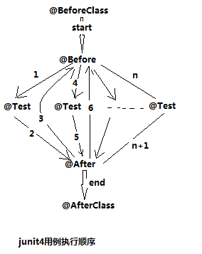

## junit4
-----
### 执行顺序

@BeforeClass：针对所有测试，只执行一次，且必须为static void  
@Before：初始化方法  
@Test：测试方法，在这里可以测试期望异常和超时时间  
@After：释放资源  
@AfterClass：针对所有测试，只执行一次，且必须为static void  

- junit4.x版本我们常用的注解：  
    - A、@Before 注解：与junit3.x中的setUp()方法功能一样，在每个测试方法之前执行；  
    - B、@After 注解：与junit3.x中的tearDown()方法功能一样，在每个测试方法之后执行；  
    - C、@BeforeClass 注解：在所有方法执行之前执行；  
    - D、@AfterClass 注解：在所有方法执行之后执行；  
    - E、@Test(timeout = xxx) 注解：设置当前测试方法在一定时间内运行完，否则返回错误；  
    - F、@Test(expected = Exception.class) 注解：设置被测试的方法是否有异常抛出。抛出异常类型为：Exception.class；  
    - G、@Ignore 注解：注释掉一个测试方法或一个类，被注释的方法或类，不会被执行。  